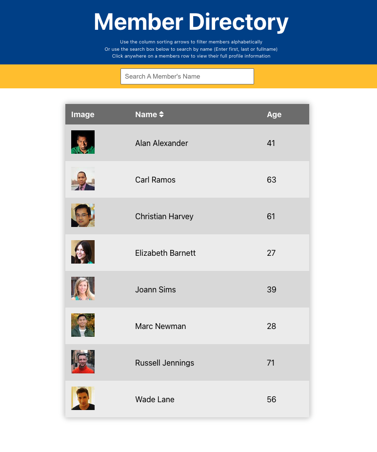

<h1 align="center"><a href="https://github.com/johnsonr84/random-user">👩 Random User 👨</a></h1>

## Description

* Random User utilizes React Hooks to filter and sort members by first and / or last name.
* Click on the member to view their individual profile page which features a large picture of the member, the member’s first and last name, street, city, state, postcode, email address, date of birth, and phone number.
* The UI is broken up into components, managed by state and responds to user events.
* The member data is retrieved using an HTTP request to the [Random User API](https://randomuser.me/) 
* I am hoping this test will be technically, logically and programatically correct to the guidlines set forth in the "Random User Test" document and will serve to facilitate my goal for gainful full-time employment, enabling me to not only lead a productive and meaningful daily life, but also so that I may continue purchase my dog endless amounts of squeek toys, bones, retractable leashes and cheesy (but cute) dog sweaters... 🐶

[](https://github.com/johnsonr84)
[](https://github.com/johnsonr84/random-user)
[](https://github.com/johnsonr84/random-user)
[](https://choosealicense.com/licenses/mit/)
  
## Built With
[](https://reactjs.org/)
<!-- [](https://reactrouter.com/) -->

## Table of Contents 
- [Description](#Description)
- [Outcome](#Outcome)
- [Project URL](#Project-URL)
- [Deployment](#Deployment)
- [Demo/Screenshots](#Demo/Screenshots)
- [Technologies](#Technologies)
- [Installation](#Installation)
- [Credits](#Credits)
- [License](#License)
- [Resources](#Resources)
- [Contact](#Contact)
- [Author](#Author)
  
## Outcome

- It is responsive to different screen sizes of devices such as mobile, tablet, and desktop.

## Project URL
https://github.com/johnsonr84/random-user

## Deployment Link
https://johnsonr84.github.io/random-user/

## Demo/Screenshots
  <table>
    <tr>
      <td>Members List Example</td>
    </tr>
    <tr>
      <td></td>
    </tr>
      <tr>
      <td>Member Profile Example</td>
    </tr>
    <tr>
      <td></td>
    </tr>
  </table>

## Technologies 
```
React, React Hooks, Random User API
```

## Installation 
Access to GitHub.com and a code editor such as vscode is necessary. Click the GitHub link provided above to the APP REPO. Click on the green button that says Clone or Download and Choose how you would like to download: using the SSH/HTTPS keys or download the zip file. If using SSH/HTTPS Key: You will copy the link shown and open up either terminal (mac: pre-installed) or gitbash (pc: must be installed). Once the application is open, you will type git clone paste url here. If using Download ZIP: Click on Download Zip. Locate the file and double click it to unzip the file. Locate the unzipped folder and open it. 

## Usage 
In order to use this APP, you need terminal (mac: pre-installed) or gitbash (pc: must be installed). You also need to download and install [node.js](https://nodejs.org/en/) and [npm](www.npmjs.com) or [yarn](https://yarnpkg.com/) package manager. Open the cloned REPO in your favorite code editor, and then in terminal, enter the command “npm i“ or “yarn add”  to install the dependencies.  Now you are ready to start using the app by entering “npm start” or "yarn start" on your terminal or gitbash. If you just want to try how the app works, you can go to the link [here](https://github.com/johnsonr84/random-user)

## Credits 
Me, myself and Irene 

## License 
This project is [mit](https://choosealicense.com/licenses/mit/) licensed.

## Features
Coming soon maybe 

## Resources
* [Choose a License](https://choosealicense.com/)
* [Badmath](https://img.shields.io/github/languages/top/nielsenjared/badmath)
* [shields.io](https://shields.io/)
* [React.js](https://reactjs.org/)
* [Random User API](https://randomuser.me/)

## Contact
Email: robertcjohnson1984@gmail.com 

## Author
Rob Johnson  

GitHub: https://github.com/johnsonr84/ 
